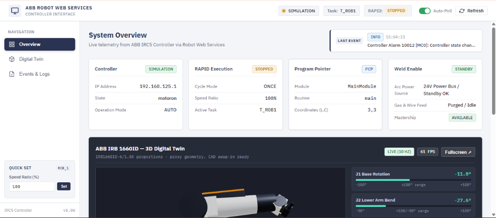
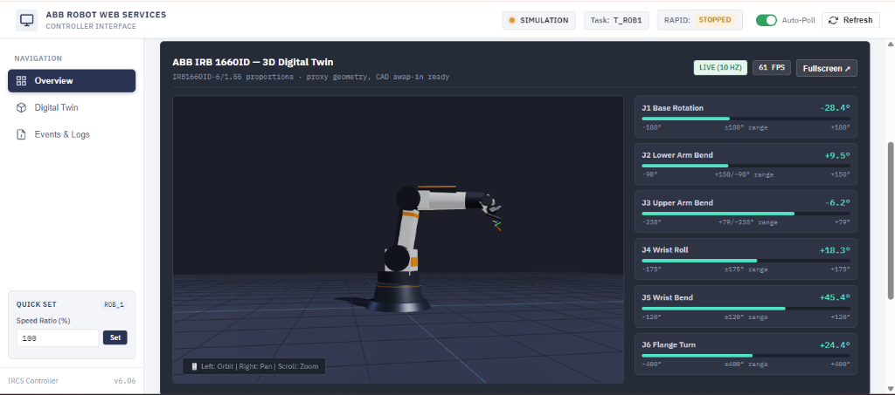

# ABB Robot Web Services (RWS) Dashboard

An industrial-grade, web-based monitoring and control dashboard for ABB Robot Controllers (IRC5 / OmniCore) using **Robot Web Services (RWS)**.

Built with **FastAPI** (Python backend) and a responsive, offline-ready **HTML5 / CSS3 / JavaScript** industrial user interface.

---

## Dashboard Preview

### System Overview & Controller Telemetry


### 3D Digital Twin with Real-Time Kinematics & Joint Angles


---

## Features

- **Controller Telemetry**: Real-time status, motor state, operational mode (`AUTO`/`MANUAL`), system health, and connection latency.
- **RAPID Execution Control**: Live state monitoring (`RUNNING` / `STOPPED`), cycle modes (`ONCE` / `CONTINUOUS`), program Start, Stop, and Reset to Main with two-step safety confirmation interlocks.
- **Program Pointer (PCP) Navigation**:
  - Live inspection of current module, routine, line, and column coordinates.
  - Set Program Pointer to Routine (`set-pp-routine`).
  - Set Program Pointer to Cursor coordinates (`set-pp-curser`).
  - Step forward (`set-pp-next-inst`) and step backward (`set-pp-prev-inst`) by instruction.
- **RAPID Module Management**:
  - Drag-and-drop file upload of `.mod` and `.sys` modules to `$HOME/` on the controller.
  - Load modules with replace flag (`action=loadmod`).
  - Unload modules with safety confirmation (`action=unloadmod`).
- **I/O Signal Monitoring & Control**:
  - Real-time display of Digital Inputs (DI), Digital Outputs (DO), and Analog signals (AI/AO).
  - Search signals by name with real-time filtering.
  - Safe output state toggling with confirmation dialogs.
- **Event & Error Logging**:
  - Timestamped audit log of operator actions, RWS communications, and controller alerts.
  - Filter by severity (`INFO`, `WARNING`, `ERROR`).
  - One-click JSON export and log clearing.
- **Hardware & System Specifications**:
  - Controller model, RobotWare release version, serial number, system name.
  - Robot arm model (`IRB 120-3/0.6`), mechanical unit name (`ROB_1`), kinematics (6-axis), payload, and reach.
- **Transparent Simulation Fallback**:
  - Allows full dashboard development and testing when physical robot (`192.168.125.1`) is offline.
  - Seamlessly switches to physical controller communication when plugged into service port or factory LAN.

---

## System Architecture

```text
+-------------------------------------------------------------+
|                      WEB BROWSER UI                         |
|                                                             |
|   HTML5 + Industrial CSS3 (Dark Theme) + Vanilla JS SPA     |
|   - 1000ms Fast Polling (State, PP)                         |
|   - 4000ms Normal Polling (Modules, I/O, Events)            |
+------------------------------+------------------------------+
                               |
                               | REST APIs (JSON)
                               v
+-------------------------------------------------------------+
|                    FASTAPI BACKEND                          |
|                                                             |
|   - Router Dispatchers (/api/controller, /api/rapid, ...)   |
|   - Service Layer (Rapid, Module, IO, System, Events)       |
|   - Central RWS Client (HTTPDigestAuth, Session cookies)    |
|   - Mastership Context Manager (Request / Release)          |
|   - Simulation Fallback Engine                              |
+------------------------------+------------------------------+
                               |
                               | HTTP Digest Auth Requests
                               v
+-------------------------------------------------------------+
|                 ABB ROBOT CONTROLLER (IRC5)                 |
|                                                             |
|   - Service Port: 192.168.125.1:80                          |
|   - Robot Web Services (RWS 1.0)                            |
|   - RAPID Task: T_ROB1                                      |
+-------------------------------------------------------------+
```

---

## Directory Structure

```text
rws_dashboard/
├── backend/
│   ├── config.py                  # Controller IP, credentials, timeouts, simulation toggle
│   ├── rws_client.py              # Central RWS client with DigestAuth, session cookies, mastership
│   ├── services/
│   │   ├── controller_service.py  # Controller status, panel state, operation mode
│   │   ├── rapid_service.py       # Execution state, program pointer, execution controls
│   │   ├── module_service.py      # Module listing, file upload to $HOME, load, unload, replace
│   │   ├── io_service.py          # Digital/analog inputs & outputs, signal search & filtering
│   │   ├── system_service.py      # Controller info, RobotWare version, robot specs
│   │   └── event_service.py       # Event logging, action audits, alert tracking
│   ├── routers/
│   │   ├── controller.py          # /api/controller/status, /api/controller/info
│   │   ├── rapid.py               # /api/rapid/execution, /api/rapid/program-pointer, execution controls
│   │   ├── modules.py             # /api/rapid/modules, upload, load, unload
│   │   ├── io.py                  # /api/io/signals, /api/io/digital-inputs, /api/io/digital-outputs
│   │   ├── system.py              # /api/system/info
│   │   └── events.py              # /api/events
│   └── main.py                    # FastAPI entrypoint, CORS, static file mounts
├── frontend/
│   ├── index.html                 # Complete industrial dashboard UI with 9 views
│   ├── css/
│   │   └── style.css              # Industrial theme (ABB dark/light accents, cards, badges, modals)
│   └── js/
│       └── dashboard.js           # View switching, 1s/4s polling loops, API integrations, toast alerts
├── screenshots/
│   ├── system_overview.png        # System Overview & telemetry screenshot
│   └── digital_twin_3d.png        # 3D Digital Twin screenshot
├── tests/
│   └── test_api.py                # Automated pytest/test suite for all endpoints and RWS client
├── run.py                         # Single-command launcher for backend & dashboard
├── requirements.txt               # Dependencies: fastapi, uvicorn, requests, python-multipart
└── README.md                      # Documentation
```

---

## Quick Start

### 1. Install Dependencies

```bash
pip install -r requirements.txt
```

### 2. Launch the Dashboard

```bash
python run.py
```

Open your browser and navigate to:
- **Dashboard Interface**: [http://127.0.0.1:8000](http://127.0.0.1:8000)
- **Interactive API Documentation (Swagger)**: [http://127.0.0.1:8000/docs](http://127.0.0.1:8000/docs)

---

## Configuration

Settings can be changed directly from the **Settings** tab in the dashboard or via environment variables:

| Variable | Default Value | Description |
|---|---|---|
| `ROBOT_IP` | `192.168.125.1` | Controller IP address (192.168.125.1 for service port X22) |
| `ROBOT_PORT` | `80` | RWS HTTP port |
| `ROBOT_USERNAME` | `Default User` | Controller user with RWS permissions |
| `ROBOT_PASSWORD` | `robotics` | Controller password (kept private on backend) |
| `ROBOT_TASK` | `T_ROB1` | Target RAPID motion task |
| `ROBOT_TIMEOUT` | `3.0` | HTTP request timeout in seconds |
| `SIMULATION_MODE` | `false` | Enable simulation mode explicitly |

---

## Running the Automated Test Suite

To run all automated API and service tests:

```bash
python -m pytest tests/test_api.py -v
```
